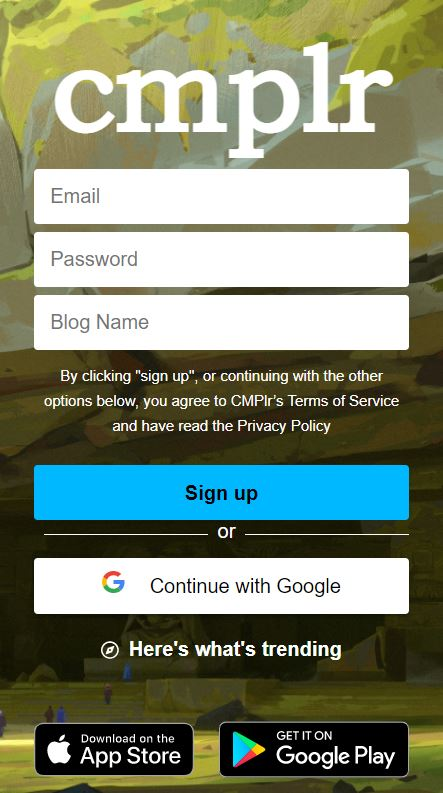
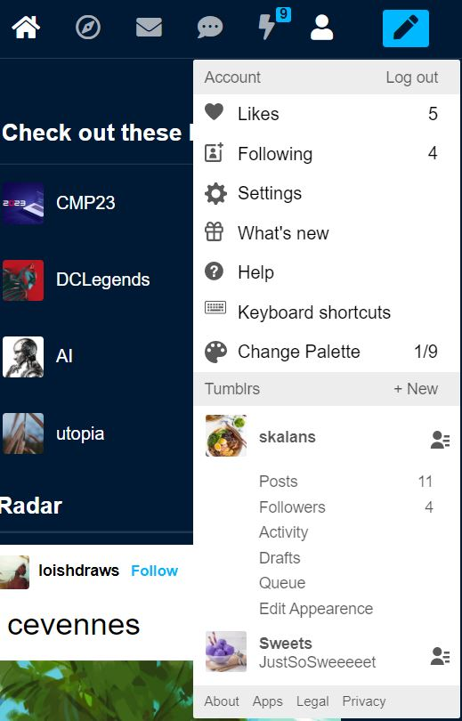
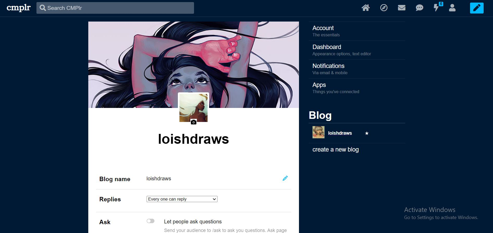

<div align="center">

</div>
<h1 align="center">
  CMPLR - Frontend
</h1>
<p align="center">

  <a style="text-decoration:none" href="https://www.cmplr.tech/">
    
  </a>

  <a style="text-decoration:none" href="https://github.com/CMPLR-Technologies/CMPLR-Frontend/graphs/contributors">
    
  </a>

  <a style="text-decoration:none" href="https://github.com/CMPLR-Technologies/CMPLR-Frontend/issues">
    
  </a>

  <a style="text-decoration:none" href="https://github.com/CMPLR-Technologies/CMPLR-Frontend/stargazers">
    
  </a>

  
</p>

# Overview

Responsive Frontend which mocks tumbler ui/ux. !!TODO

# Built With

<div align="center">


</div>

# Covered Features

Below are brief descriptions of highlighted features with GIFs and screenshoots showcasing the website.

## Getting Started

A landing page for cmplr's new guests is shown below. Also, 2 screenshoots of the Sign Up & Login Pages in mobile view are attached.

<div align="center">

</div>

<div align="center">
  <b>A scroll through the "getting started" Landing page</b>
</div>
<br/>

<div align="center">


</div>

<div align="center">
  <b>Sign Up & Login Pages in mobile view</b>
</div>
<br/>

## Dashboard & Posts

In Dashboard, you can follow recommended blogs on the sidebar, see a featured post, create posts from the top panel or simply scroll through the latest posts from your followed blogs. Just once you reach the last post, more posts are loaded for you to see.

When creating posts from the top panel (or from the pencil icon from nav bar), you can fully customize your post:

-   Add a title to the post.
-   Change formatting, size and/or color of text by either shortcuts or editor.
-   Attach images, videos and/or links to the post
-   Add tags to associate the post with other relevant posts

When viewing posts, you can follow the user, block them, like the post, comment on it and/or copy the link in order to save it.

Also, as shown below, we implemented 9 different themes for the whole website using React's contexts (last one is our original :D).

<div align="center">

</div>

<div align="center">
  <b>A scroll through Posts in Dashboard showing infinite scrolling</b>
</div>
<br/>

<div align="center">

</div>

<div align="center">
  <b>Showing different types of interactions with posts in Dashboard</b>
</div>
<br/>

<div align="center">

</div>

<div align="center">
  <b>Showing how to create a post and customize it (for example: alt + b on first word). </b>
</div>
<br/>

<div align="center">

</div>

<div align="center">
  <b>Showing 9 different themes, they are changed by Alt + P shortcut (or from account popup in nav)</b>
</div>
<br/>

## Blog Views

On hovering on any username or avatar, anywhere in our website, a mini popup comes up showing blog's data and images from recent posts. By clicking on this popup pr the username, a side view of the blog slides in (supporting only post of the recent images). By clicking on the user from this view, you can navigate the the full blog view, showing his posts, liked posts, followed blogs & more. Both of the latter views have a navigation bar allowing the user to block, follow the blog and more.

<div align="center">

</div>

<div align="center">
  <b>Blog Mini View on Hover and Blog Side View</b>
</div>
<br/>

<div align="center">

</div>

<div align="center">
  <b>Blog Full window View showing blog posts and follow actions</b>
</div>
<br/>

<div align="center">

</div>

<div align="center">
  <b>Blog Full window View showing blog likes and followings</b>
</div>
<br/>

## Account Actions

<div align="center">

</div>

As shown above, in the navbar, when you click on the account icon, a popup shows up where you can:

-   Log out
-   Create new blogs for the same account
-   Change account settings
-   View the posts you liked & the blogs you follow
-   Visit Help Center or veiw Shortcuts
-   Change Palette (or alt + P)
-   View your blogs along with their **posts, activiy and followers**

In the Settings pages, you can change account settings, dashboard settings, notification settings and blog settings.In the activity page you can see a history of new followers, new likes and ineteractions.

<div align="center">

</div>

<div align="center">
  <b>My Blog Posts and Activity Graphs</b>
</div>
<br/>

<div align="center">

</div>

<div align="center">
  <b>Shows Blogs that the user is following</b>
</div>
<br/>

<div align="center">

</div>

<div align="center">
  <b>Showing articles in the help center</b>
</div>
<br/>

<div align="center">

</div>

<div align="center">
  <b>Blog Settings</b>
</div>
<br/>

## Explore & Tags

In the Explore pages, you can explore posts that are recommended for you, trending posts, or staff picks. You can browse these posts in a compact grid view or the stretched dashboard-like column view. 

You can also follow featured & trending tags, the followed tags are shown in the sidebar below, you can visit any ot those tags to browse all posts from it. 

<div align="center">

</div>

<div align="center">
  <b>Showing Different types of views in the Explore pages</b>
</div>
<br/>

<div align="center">

</div>

<div align="center">
  <b>An Example of Tag page</b>
</div>
<br/>

## Chatting & Notifications

When your posts get interactions or someone follows you, you get a notification about it. Moreover, you can check all notifications from the navbar. You can also find new messages in the nav bar and click on the user to chat with them as shown below.

<div align="center">

</div>

<div align="center">
  <b>Notifications Example</b>
</div>
<br/>

<div align="center">

</div>

<div align="center">
  <b>Chatting Example</b>
</div>
<br/>

## Mobile Resoponsivity

We have implemented tumblr's whole website design while making sure it looks good across different screen sizes, below are some simple examples of how it looks on mobile screens in some of the website pages.

<div align="center">


</div>

<div align="center">
  <b>Showing different themes and pages like dashboard, likes and activity in mobile view</b>
</div>
<br/>

# Project Structure (minified)

```
CMPLR-Frontend
├─ .env
├─ 💻.eslintrc.js
├─ .gitignore
├─ .prettierrc
├─ 🐳Dockerfile
├─ jenkinsfile
├─ 📊jsdoc.json
├─ 📁nginx
├─ 📊package-lock.json
├─ 📊package.json
├─ 📁public
│  ├─ 💻firebase-messaging-sw.js
│  ├─ 🖼️icon.jpg
│  ├─ 🧱index.html
│  ├─ 📊manifest.json
│  └─ 💬robots.txt
├─ README.md
├─ 📁src
│  ├─ 💻App.js
│  ├─ 📁assets
│  │  ├─ 📁backgrounds
│  │  ├─ 📁images
│  │  └─ 📁js
│  │     └─ 💻backgroundImages.js
│  ├─ 📁components
│  │  ├─ ⚛️activityPageComponent
│  │  ├─ ⚛️askComponent
│  │  ├─ ⚛️blogSettingsComponent
│  │  ├─ ⚛️chatComponent
│  │  ├─ ⚛️createPost
│  │  ├─ ⚛️dashboardComponent
│  │  ├─ ⚛️deleteAccountComponent
│  │  ├─ ⚛️desktopNotifications
│  │  ├─ ⚛️explore
│  │  ├─ ⚛️followingComponent
│  │  ├─ ⚛️forgetPasswordComponent
│  │  ├─ ⚛️hashtagsComponent
│  │  ├─ ⚛️HelpCenter
│  │  ├─ ⚛️homeComponent
│  │  ├─ ⚛️inboxComponent
│  │  ├─ ⚛️likesComponent
│  │  ├─ ⚛️loginComponent
│  │  ├─ ⚛️MyProfileComponent
│  │  ├─ ⚛️navbar2Files
│  │  │  ├─ ⚛️navbar2MainView
│  │  │  └─ ⚛️navbar2SideView
│  │  ├─ 📁navbarComponent
│  │  │  ├─ 📁containers
│  │  │  │  ├─ 📁navbarLinks
│  │  │  │  │  ├─ ⚛️AccountPopup
│  │  │  │  │  ├─ ⚛️links
│  │  │  │  │  ├─ ⚛️MessagesPopup
│  │  │  │  │  └─ ⚛️newPost
│  │  │  │  ├─ ⚛️Notifications
│  │  │  │  └─ ⚛️searchBar
│  │  ├─ ⚛️notfoundComponent
│  │  ├─ 📁partials
│  │  │  ├─ ⚛️AuthAlert.jsx
│  │  │  ├─ ⚛️AuthBtn.jsx
│  │  │  ├─ ⚛️AuthFooter.jsx
│  │  │  ├─ ⚛️AuthInput.jsx
│  │  │  ├─ ⚛️GridPostsView.jsx
│  │  │  ├─ ⚛️MockedComponent.jsx
│  │  │  ├─ ⚛️Modal.jsx
│  │  │  ├─ ⚛️OrBar.jsx
│  │  │  ├─ ⚛️PlaystoreApplestore.jsx
│  │  │  ├─ ⚛️postComponent
│  │  │  ├─ ⚛️Radar.jsx
│  │  │  └─ ⚛️VerticalPostsView.jsx
│  │  ├─ 📁profileViews
│  │  │  ├─ ⚛️fullView
│  │  │  └─ 📁mini&sideViews
│  │  │     ├─ ⚛️miniView
│  │  │     └─ ⚛️sideView
│  │  ├─ ⚛️registerComponent
│  │  ├─ ⚛️resetPasswordComponent
│  │  ├─ ⚛️RichTextEditor
│  │  ├─ ⚛️routes
│  │  ├─ ⚛️settingsComponent
│  │  └─ ⚛️verifyEmail
│  ├─ 📊config.json
│  ├─ 📁contexts
│  │  ├─ ⚛️blogSettingsContext
│  │  ├─ ⚛️chatContext
│  │  ├─ ⚛️settingsContext
│  │  ├─ ⚛️themeContext
│  │  └─ ⚛️userContext
│  ├─ 💻fiberbaseInit.js
│  ├─ 📁hooks
│  │  ├─ 💻useFetch.js
│  │  ├─ 💻useInfiniteScrolling.js
│  │  └─ 💻useInfinteScrollingChat.js
│  ├─ 💻index.js
│  ├─ 💻reportWebVitals.js
│  ├─ 💻setupTests.js
│  ├─ 📁styles
│  │  ├─ 📁fonts
│  │  │  └─ 🖼️Favorit.ttf
│  │  ├─ 📁scss
│  │  │  ├─ 🎨accountpopupComponent
│  │  │  ├─ 🎨activityStyles
│  │  │  ├─ 🎨askStyles
│  │  │  ├─ 🎨blogSettingsStyles
│  │  │  ├─ 🎨chatStyles
│  │  │  ├─ 🎨createPostStyles
│  │  │  ├─ 🎨dashboardStyles
│  │  │  ├─ 🎨deleteAccountStyles
│  │  │  ├─ 🎨exploreStyles
│  │  │  ├─ 🎨followingStyles
│  │  │  ├─ 🎨forgetPasswordStyles
│  │  │  ├─ 🎨hashtagsStyles
│  │  │  ├─ 🎨helpCenter
│  │  │  ├─ 🎨homeStyles
│  │  │  ├─ 🎨loginStyles
│  │  │  ├─ 🎨myProfileStyles
│  │  │  ├─ 🎨navbarComponent
│  │  │  ├─ 🎨navbarProfileViewsStyles
│  │  │  ├─ 🎨notfoundStyles
│  │  │  ├─ 📁partials
│  │  │  │  ├─ 🎨authAlert.scss
│  │  │  │  ├─ 🎨AuthBtn.scss
│  │  │  │  ├─ 🎨AuthFooter.scss
│  │  │  │  ├─ 🎨AuthInput.scss
│  │  │  │  ├─ 🎨OrBar.scss
│  │  │  │  ├─ 🎨_onOffSwitch.scss
│  │  │  │  └─ 🎨_postComponent.scss
│  │  │  ├─ 🎨profileViews
│  │  │  ├─ 🎨registerStyles
│  │  │  ├─ 🎨richTextEditorStyles
│  │  │  ├─ 🎨settingsStyles
│  │  │  ├─ 🎨shortcutsStyles
│  │  │  ├─ 🎨styles.scss
│  │  │  └─ 🎨verifyEmailStyles
│  │  └─ 🎨styles.css
│  └─ 📁__mock_database
│     ├─ 📊db.json
│     └─ 📊routes.json
└─ yarn.lock

```
